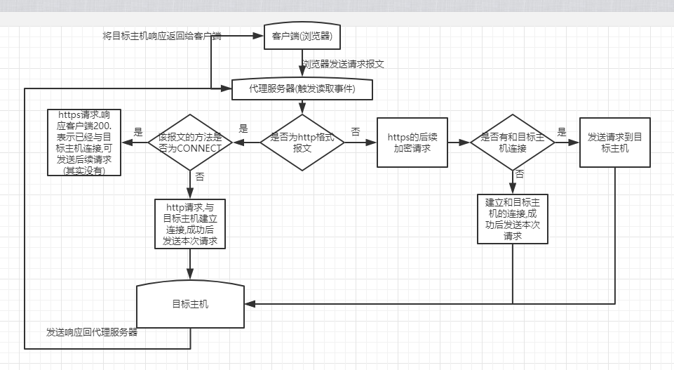

#### ZX-Jump Http/Https代理服务器 用于穿越长城
* 之前想安装个chrome插件,结果蓝灯崩了,而github上许多的翻墙软件也被封了.还有的软件下载界面全是反共的宣言,  
不太信得过.于是去vultr买了服务器,装了shadowsocks,但用起来不顺手,就想着自己写一个代理服务器.

#### 注意点
* ctx.writeAndFlush() 和 ctx.channel().writeAndFlush()的区别,前者会直接从当前handler发送消息,后者还会经过后续的handler.
* netty的每次创建出一个连接channel的时候都会调用在之前定义的通道初始化器初始化该channel.

#### Bug
* 放在服务器上后,稍微访问几个网页,就全部报 : java.io.IOException: Connection reset by peer

#### 开篇
* 某日无聊买了个国外的服务器自己搭了个vpn.用着别人的代理工具(shadowsocks)很不开心..于是就准备自己写一个.用了netty基本上还是很简单的.

#### 思路
* 简单说下浏览器的处理流程
    >
        假设我们访问http://www.baidu.com,浏览器会自动帮我们创建出一个http请求报文,大致如下
        GET /  HTTP/1.1     # 请求行: 请求方法 请求路径 请求协议版本,  下一行开始是请求头
        Host: www.baidu.com
        User-Agent: Mozilla/5.0 (Windows NT 6.1; WOW64) AppleWebKit/537.36 (KHTML, like Gecko) Chrome/63.0.3239.132 Safari/537.36
        Connection: keep-alive
        content-length: 0
        
        通过请求头的host得知访问的域名是www.baidu.com,通过DNS解析出ip,向该IP的80端口发送这段报文.
        此时,假设该百度ip对应的服务器上部署的是Tomcat容器,那么,Tomcat会自动解析该字符串,将其组装为HttpServletRequest.然后响应Response
        浏览器收到响应后,解析响应内容,然后进行后续操作(将html解析为页面,继续请求其中的css/js等,然后运行js等操作)
    >   

* 代理服务器的简单实现
    >
        1. 代理服务器:创建Socket服务端,监听消息.
        2. 本地配置Internet选项的Http代理,将自己电脑(浏览器)的所有请求转发到代理服务器.
        3. 代理服务器获取到本机发送的请求报文后,转发给目标主机(也就请求行中的主机信息,例如百度)
        4. 目标主机响应信息给代理服务器后,地理服务器将响应发送回自己的电脑(浏览器)即可.
    >
* 如上只适用于普通的Http请求,但如果是Https,大致流程如下(参考:https://zhuanlan.zhihu.com/p/28767664):
    
    1. 浏览器发送Http Connect连接请求
    > CONNECT baidu.com:443 HTTP/1.1
    2. 代理服务器收到请求后,同样解析出 目标主机 和 端口(443),然后与目标主机建立TCP连接,并先响应给浏览器如下报文
    > HTTP/1.1 200 Connection Established
    3. 建立完连接后,浏览器继续发送后续的请求内容,我们需要将其转发给目标主机,然后目标主机也会发送回响应,我们同样将其发送回浏览器.
    4. 如上发送/响应可能会进行多次,并且内容都是经过加密的.

* 流程图 

   
* 总结
    >
        对于普通Http请求,我们要做的只是转发请求到目标主机,并且中间可以任意获取/篡改请求或响应内容.
        而对于Https请求,我们需要事先建立和目标主机的连接,然后告诉浏览器连接建立成功,然后让双方任意发送消息.
        如此,也可以得出,Http想比于Https,安全性实在太弱.
    >

#### 大致流程
* 使用SpringBoot搭建.
* 使用Netty作为服务端.然后设置好internet中的代理为127.0.0.1:port(注意,需要禁用其中的自动脚本,因为它的优先级比普通代理高)
* 于是,在读取事件中,获取到浏览器的请求报文,例如:
    * Http
        >
            GET http://csdnimg.cn/public/favicon.ico HTTP/1.1
            Host: csdnimg.cn
            Proxy-Connection: keep-alive
            Pragma: no-cache
            Cache-Control: no-cache
            User-Agent: Mozilla/5.0 (Windows NT 6.1; WOW64) AppleWebKit/537.36 (KHTML, like Gecko) Chrome/63.0.3239.132 Safari/537.36
            Accept: image/webp,image/apng,image/*,*/*;q=0.8
            Referer: http://blog.csdn.net/zuoxiaolong8810/article/details/65441709
            Accept-Encoding: gzip, deflate
            Accept-Language: zh-CN,zh;q=0.9
            content-length: 0
        
            第一行为请求行,包括了http的请求方式,请求的主机和请求的http协议版本.
            后面都是请求头,包括了Cookies等信息(如果有的话).最后的content-length: 0,是因为GET请求没有请求体.
        >
    * Https
        >
            CONNECT webim.tim.qq.com:443 HTTP/1.1
            Host: webim.tim.qq.com:443
            Proxy-Connection: keep-alive
            User-Agent: Mozilla/5.0 (Windows NT 10.0; WOW64) AppleWebKit/537.36 (KHTML, like Gecko) Chrome/62.0.3202.94 Safari/537.36
            
            对于HTTPS来说,第一次的请求都是CONNECT(连接请求).请求头的信息通常也就这么3个主要的.
        >
    * 代理和非代理报文区别
        >
            可以发现,在使用ip代理后,请求报文有如下变化:
                1. 浏览器会自动在请求行上添加要请求的完整路径.(例如, GET /public/favicon.ico HTTP/1.1 变为了 GET http://csdnimg.cn/public/favicon.ico HTTP/1.1)
                    这个设计是因为在早期Http设计中,没有http代理时,目标服务器收到请求后,假设请求行中的uri为/a/b.
                    那么目标服务器可以很清楚的知道它要访问的是自己的/a/b路径.
                    而使用代理后,并不知道 目标服务器的完整地址,所以需要携带目标服务器的完整路径.
                    后来,为了解决虚拟主机的问题,几乎所有的浏览器都会在请求头中携带host属性,也就解决了这个问题.
                2. 请求头中的Connection属性变为Proxy-Connection
                    (Http1.1中,默认keep-alive,除非显式指定Connection: close)
                    因为老旧代理(Http1.0)不认识Connection属性,会将其作为无关属性直接转发给目标服务器.
                    但目标服务器会根据其要求(Connection: keep-alive),保持长连接,而代理则不会保持这个连接.
                    客户端收到代理转发回去的响应后(浏览器也会根据其要求),保持长连接,但此时代理已经关闭了这个连接.
                    为了解决这个问题,就出现了Proxy-Connection,
                        如果代理是Http1.1,那么,可将其自动重写为Connection.再发送给目标服务器.
                        如果代理是1.0,那么,服务器会收到Proxy-Connection,就发现它是代理,因为它没有自动将其转为Connection.就会在响应中添加Connection:close即可.
        >
    * 臆想
        >
            那么,对于匿名代理服务器的实现,应该就是类似的原理.我们将浏览器给代理服务器专门添加的信息去除,然后篡改请求头中的ip等信息.
            此外,除了设置internet选项,还可以通过设置dns来使用代理服务器,例如自己搭建个dns后,将所有域名都映射到代理服务器上即可.
        >
        
* 测试:接收请求后,不将其转发给目标主机,直接返回自定义的响应报文
    * 伪代码(Http规定头信息必须有\r\n\r\n,一旦读取到\r\n\r\n,就会将往后的部分识别为请求主体,例如下面的html和响应头空了一行,也就是\r\n\r\n) 
    >
        //拼接出自定义响应报文
        StringBuilder sb = new StringBuilder();
        sb.append("HTTP/1.1 200 OK\r\n")
                .append("Content-Type: text/html; charset=UTF-8\r\n\r\n")
                .append("<html>" +
                        "<head></head>" +
                        "<body>" +
                        "<h1>测试响应</h1>" +
                        "</body>" +
                        "</html>");
        //将自定义响应报文发送回浏览器                
        sendResponse(sb.toString().getBytes("UTF-8"));
    >
    * 响应报文
    >
        HTTP/1.1 200 OK
        Content-Type: text/html; charset=UTF-8
        
        <html><head></head><body><h1>测试响应</h1></body></html>
        
        
        第一行为响应行,然后是响应头,然后是响应主体
    >
    * 此时,浏览器访问Http网页时,将会在页面上显示 测试响应

#### 开始编码
* Netty服务端启动类,启动Socket监听对应端口
    >
        /**
         * 启动Netty server,监听指定端口的TCP连接.
         * 此处监听客户端向我们发送的http报文
         */
        @SneakyThrows
        public void start() {
            //1 用于接收Client的连接 的线程组
            EventLoopGroup bossGroup = new NioEventLoopGroup(proxyConfig.getSocket().getClientThreadNum());
            //2 用于实际业务操作的线程组
            EventLoopGroup workerGroup = new NioEventLoopGroup(proxyConfig.getSocket().getEventThreadNum());
            //3 创建一个辅助类Bootstrap（引导程序）,对server进行配置
            ServerBootstrap serverBootStrap = new ServerBootstrap();
            //4 将两个线程组加入 bootstrap
            serverBootStrap.group(bossGroup, workerGroup)
                    //指定使用这种类型的通道
                    .channel(NioServerSocketChannel.class)
                    //使用 childHandler 绑定具体的事件处理器
                    .childHandler(new ChannelInitializer<SocketChannel>() {
                        @Override
                        protected void initChannel(SocketChannel socketChannel) throws Exception {
                            //设置字符串形式的解码  这样serverHandler中获取到的msg可以直接(String)msg转为string
                            socketChannel.pipeline()
                                    //组合了http请求解码器和http响应编码器的一个类,可自定义各种最大长度
                                    .addLast(NAME_HTTP_CODE_HANDLER, new HttpServerCodec())
                                    //消息聚合器,注意,需要添加在http编解码器(HttpServerCodec)之后
                                    .addLast(NAME_HTTP_AGGREGATOR_HANDLER, new HttpObjectAggregator(65536))
                                    //自定义 输入事件 处理器
                                    .addLast(proxyServerOutboundHandler)
                                    //自定义 客户端输入事件 处理器
                                    .addLast(NAME_PROXY_SERVER_HANDLER, proxyServerHandler);
                        }
                    })
                    //服务端接受连接的队列长度
                    .option(ChannelOption.SO_BACKLOG, 2048)
                    //接收缓冲区大小
                    .option(ChannelOption.SO_RCVBUF, 128 * 1024);
            log.info("代理服务器启动,在{}端口",proxyConfig.getSocket().getProxyPort());
            //5 绑定端口,进行监听 异步的  可以开启多个端口监听
            ChannelFuture future = serverBootStrap.bind(proxyConfig.getSocket().getProxyPort()).sync();
            //6 关闭前阻塞
            future.channel().closeFuture().sync();
            //7 关闭线程组
            bossGroup.shutdownGracefully().sync();
            workerGroup.shutdownGracefully().sync();
        }
    >

* 代理服务器 输入事件处理类
    * 主要功能如下:
        * 接收客户端报文
        * 当报文为Http协议时,另起一个连接,连接到目标服务器,并给这个与目标服务器的连接设置监听器/处理器  
            >
                连接成功后,在该监听器中自动发送客户端发送的报文 给 目标服务器,目标服务器响应后,
                处理器读取事件被触发, 读取该响应,发送回客户端即可.
            >
        * 当报文为Https协议时,先直接返回客户端200响应,表示已经与目标服务器建立了连接,
            >
                此时,客户端会继续发送后续的加密信息,这时,我们另起一个连接,连接到目标服务器,并给这个连接设置监听器/处理器.
                后续我们直接将客户端报文转发给目标服务器,将目标服务器的响应转发回客户端即可.
                这些后续操作,在channelRead()方法中,是判断收到的消息是不是FullHttpRequest的子类,也就是不是符合http报文格式来判断的.
                如果不符合,即表示其为https请求的后续操作.
            >
        * 因为考虑将该类设置为可供所有channel使用,所以,使用缓存,以便在https协议后续请求到来时,还能获取到之前的
    * 主要代码- 与客户端连接的通道读取到客户端发送的报文
    >
           /**
             * 通道读取到消息 事件
             */
            @Override
            public void channelRead(ChannelHandlerContext ctx, Object msg) throws Exception {
                //通道id
                String channelId = ProxyUtil.getChannelId(ctx);
        
                //HTTP/HTTPS : 如果是 http报文格式的,此时已经被编码解码器转为了该类,
                if (msg instanceof FullHttpRequest) {
                    final FullHttpRequest request = (FullHttpRequest) msg;
                    //获取ip和端口
                    InetSocketAddress address = ProxyUtil.getAddressByRequest(request);
        
                    //HTTPS :
                    if (HttpMethod.CONNECT.equals(request.method())) {
                        log.info(LOG_PRE + ",https请求.目标:{}", channelId, request.uri());
        
                        //给客户端响应成功信息 HTTP/1.1 200 Connection Established  .如果失败时关闭客户端通道 - 该方法是自己封装的
                        //此处没有添加Connection Established,似乎也没问题
                        if (!ProxyUtil.writeAndFlush(ctx, new DefaultFullHttpResponse(HttpVersion.HTTP_1_1, HttpResponseStatus.OK), true))
                            return;
        
                        //此处将 该通道 的用于报文编码解码的处理器去除,因为后续发送的https报文都是加密过的,不符合一般报文格式,我们直接转发即可
                        ctx.pipeline().remove(ProxyServer.NAME_HTTP_CODE_HANDLER);
                        ctx.pipeline().remove(ProxyServer.NAME_HTTP_AGGREGATOR_HANDLER);
        
                        //用通道id作为key,将 目标服务器地址存入, 此时 第二个参数(ChannelFuture)为null,因为 我们还未和目标服务器建立连接
                        ChannelCacheUtil.put(channelId, new ChannelCache(address, null));
        
                        //直接退出等待下一次双方连接即可.
                        return;
                    }
                    //HTTP: 运行到这里表示是http请求
                    log.info(LOG_PRE + ",http请求.目标:{}", channelId, request.uri());
        
                    //连接到目标服务器.并将当前的通道上下文(ctx)/请求报文(msg) 传入
                    connect(true, address, ctx, msg, proxyConfig);
        
                    return;
                }
        
                //其他格式数据(建立https connect后的客户端再次发送的加密数据):
        
                //从缓存获取之前处理https请求时缓存的 目标服务器地址 和 与目标服务器的连接通道
                ChannelCache cache = ChannelCacheUtil.get(ProxyUtil.getChannelId(ctx));
        
                //如果缓存为空,应该是缓存已经过期,直接返回客户端请求超时,并关闭连接
                if (Objects.isNull(cache)) {
                    log.info(LOG_PRE + ",缓存过期", channelId);
                    ProxyUtil.writeAndFlush(ctx, new DefaultHttpResponse(HttpVersion.HTTP_1_1, HttpResponseStatus.REQUEST_TIMEOUT), false);
                    ctx.close();
                    return;
                }
        
                //HTTPS: 如果此时 与目标服务器建立的连接通道 为空,则表示这个Https协议,是客户端第二次传输数据过来,因为第一次我们只是返回客户端 200信息,并没有真的去连接目标服务器
                if (Objects.isNull(cache.getChannelFuture())) {
                    log.info(LOG_PRE + ",https,正在与目标建立连接");
                    //连接到目标服务器,获取到 连接通道,并将该通道更新到缓存中
                    ChannelCacheUtil.put(channelId,
                            cache.setChannelFuture(
                                    connect(false, cache.getAddress(), ctx, msg, proxyConfig)));
                } else {
        
                    //此处,表示https协议的请求第x次访问(x > 2; 第一次我们响应200,第二次同目标主机建立连接, 此处直接发送消息即可)
                    //如果此时通道是可写的,写入消息
                    if (cache.getChannelFuture().channel().isWritable()) {
                        log.info(LOG_PRE + ",https,正在向目标发送后续消息");
                        cache.getChannelFuture().channel().writeAndFlush(msg);
                    } else {
                        log.info(LOG_PRE + ",https,与目标通道不可写,关闭与客户端连接");
                        //返回 表示失败的 408状态码响应
                        ProxyUtil.responseFailedToClient(ctx);
                    }
                }
            }
    >
    * 与目标服务器建立连接的方法
        >
                /**
                 * 和 目标主机 建立连接
                 */
                private ChannelFuture connect(boolean isHttp, InetSocketAddress address,
                                              ChannelHandlerContext ctx, Object msg,
                                              ProxyConfig proxyConfig) {
                    ChannelFuture channelFuture;
                    //用工厂类构建出一个bootstrap,用来建立socket连接
                    Bootstrap bootstrap = bootstrapFactory.build();
                    //如果是http请求
                    if (isHttp) {
                        //与目标主机建立连接
                        channelFuture = bootstrap
                                //设置上http连接的通道初始化器
                                .handler(new HttpConnectChannelInitializer(ctx, proxyConfig))
                                //连接
                                .connect(address);
                        //添加监听器,当连接建立成功后.进行相应操作
                        return channelFuture.addListener(new HttpChannelFutureListener(msg, ctx));
                    }
                    //如果是Https请求
                    channelFuture = bootstrap
                            .handler(new HttpsConnectChannelInitializer(ctx))
                            .connect(address);
                    return channelFuture.addListener(new HttpsChannelFutureListener(msg, ctx));
                }
        >
* HTTP通道初始化器的初始化方法- HTTPS的初始化器和其类似,只是去掉了前两个用于消息编解码的处理器
    >
        @Override
        protected void initChannel(SocketChannel socketChannel) throws Exception {
        	socketChannel.pipeline()
        			//作为客户端时的请求编码解码
        			.addLast(new HttpClientCodec())
        			//数据聚合类,将http报文转为 FullHttpRequest和FullHttpResponse
        			.addLast(new HttpObjectAggregator(proxyConfig.getSocket().getMaxContentLength()))
        			//自定义处理器
        			.addLast(new HttpConnectHandler(ctx));
        }
    >
* 通道连接成功监听器
    * 当成功和目标服务器建立连接后,向其发送客户端的请求报文.如果失败.关闭连接等 
    >
        @Override
        public void operationComplete(ChannelFuture future) throws Exception {
        	String channelId = ProxyUtil.getChannelId(ctx);
        	//连接成功操作
        	if(future.isSuccess()){
        		log.info(LOG_PRE + ",与目标主机建立连接成功.");
        		//将客户端请求报文发送给服务端
        		if(future.channel().isWritable()){
        			future.channel().writeAndFlush(msg);
        		}else{
        			future.channel().close();
        		}
        		return;
        	}
        	log.info(LOG_PRE + ",与目标主机建立连接失败.",channelId);
        	//给客户端响应连接超时信息, 关闭 与客户端的连接
        	ProxyUtil.responseFailedToClient(ctx);
        	//清除缓存
        	ChannelCacheUtil.remove(channelId);
       
        	//日志记录
        	Throwable cause = future.cause();
        	if(cause instanceof ConnectTimeoutException)
        		log.error(LOG_PRE + ",连接超时:{}",channelId , cause.getMessage());
        	else if (cause instanceof UnknownHostException)
        		log.error(LOG_PRE + ",未知主机:{}", channelId, cause.getMessage());
        	else
        		log.error(LOG_PRE + ",异常:{}", channelId,cause.getMessage(),cause);
        	log.info(LOG_PRE + ",给客户端响应失败信息成功.",channelId);
        }
    >
* 与目标服务器的连接 事件处理类
    * 读取到目标服务器的消息时
        >
            	/**
            	 * 读取到消息
            	 *
            	 * 注意,从逻辑上来说,进行到这一步,客户端已经发送了它的请求报文,并且我们也收到目标服务器的响应.
            	 * 那么似乎可以直接使用如下语句,在将消息发回给客户端后,关闭与客户端的连接通道.
            	 * 	ctx.writeAndFlush(msg).addListener(ChannelFutureListener.CLOSE);
            	 * 	但据我理解,浏览器会复用一些通道,所以最好不要关闭.
            	 * 	(ps: 我关闭后,看直播时,无法加载出视频.... 不将它关闭,就一切正常.  并且,我之前测试过,客户端多次连接会使用相同id的channel.
            	 * 	也就是同一个TCP连接.)
            	 *
            	 */
            	@Override
            	public void channelRead(ChannelHandlerContext ctx0, Object msg) throws Exception {
            			//目标主机的响应数据
            //			FullHttpResponse response = (FullHttpResponse) msg;
            		log.info(LOG_PRE + ",读取到响应.",ProxyUtil.getChannelId(ctx));
            			//发回给客户端
            		ProxyUtil.writeAndFlush(ctx, msg, true);
            	}
        >
#### 总结
* 大致流程就是这样.全部代码可查看 https://github.com/BrightStarry/zx-jump

* 此外,如果需要设置密码等校验的话.我目前的想法是,增加一个socket,然后再写一个本地客户端,向代理服务器发送登录连接.帐号密码校验通过后,代理服务器缓存其客户端ip.  
并且,需要在每次读取到所有客户端报文时(或者弄个取模,每x次).校验客户端ip.然后每x小时清空一次ip缓存. 本地客户端需要每x - 1小时,重新发起登录请求

* 之前一直对于翻墙/代理服务器等没有一个全面的认识.(话说当年为了看xxx网站,各种找能翻墙的免费代理...在internet选项中设置ip和端口,却不解其意)

* 在自己搭建过后,是再也不会去用别人的代理服务器了,因为对于http请求来说.客户端和目标服务器间所有的请求响应都是透明的.

#### bug
* 此外,我进行过多次测试,一次性打开100+个网页.
    * 如果代理服务器部署在本地,那么不会有任何问题.
    * 如果代理服务器部署在阿里云的国内ECS上,基本也没有任何问题,但偶尔会出现: java.io.IOException: Connection reset by peer,并且基本都是在请求墙外网页时,并且不影响后续访问
    * 如果代理服务器部署在vultr的美国服务器上,则稍微点开些网页,就会出现 Connection reset by peer,并直接导致后续几乎所有请求都出现该异常.
* 关于这个bug,我在每个关键点都加了日志,在 国外服务器上,它通常是这样出现的
    * 在进行https请求时,我成功响应给客户端200响应,等待它再次发送加密报文时(才与目标服务器连接),就出现了
    >
        [2018-01-24 12:44:36.841] [nioEventLoopGroup-4-7               ] [INFO ] [c.zx.jump.handler.ProxyServerHandler:68  ] - [代理服务器处理类]通道id:5cfcc6ca,https请求.目标:account.youku.com:443
        [2018-01-24 12:44:36.842] [nioEventLoopGroup-4-7               ] [INFO ] [com.zx.jump.util.ProxyUtil          :33  ] - 通道id:5cfcc6ca,正在向客户端写入数据.
        [2018-01-24 12:44:36.843] [nioEventLoopGroup-4-7               ] [INFO ] [com.zx.jump.util.ProxyUtil          :36  ] - 通道id:5cfcc6ca,向客户端写入数据成功.
        [2018-01-24 12:44:37.077] [nioEventLoopGroup-4-7               ] [ERROR] [c.zx.jump.handler.ProxyServerHandler:156 ] - [代理服务器处理类]通道id:5cfcc6ca,发生异常:Connection reset by peer
    >
    * 或者进行http请求时, 与目标服务器成功连接后,并且读取到目标服务器响应,然后将响应写回该客户端成功后.即发生
    >
        [2018-01-24 12:44:46.849] [nioEventLoopGroup-4-3               ] [INFO ] [c.zx.jump.handler.ProxyServerHandler:87  ] - [代理服务器处理类]通道id:b00b2836,http请求.目标:http://iku.youku.com/onlineconfig/iku-caller-js
        [2018-01-24 12:44:46.861] [nioEventLoopGroup-2-3               ] [INFO ] [c.z.j.l.HttpChannelFutureListener   :44  ] - [http连接建立监听器]通道id:b00b2836,与目标主机建立连接成功.
        [2018-01-24 12:44:47.183] [nioEventLoopGroup-2-3               ] [INFO ] [c.zx.jump.handler.HttpConnectHandler:61  ] - [Http连接处理类]通道id:b00b2836,读取到响应.
        [2018-01-24 12:44:47.184] [nioEventLoopGroup-2-3               ] [INFO ] [com.zx.jump.util.ProxyUtil          :33  ] - 通道id:b00b2836,正在向客户端写入数据.
        [2018-01-24 12:44:47.185] [nioEventLoopGroup-4-3               ] [INFO ] [com.zx.jump.util.ProxyUtil          :36  ] - 通道id:b00b2836,向客户端写入数据成功.
        [2018-01-24 12:44:47.432] [nioEventLoopGroup-4-3               ] [ERROR] [c.zx.jump.handler.ProxyServerHandler:156 ] - [代理服务器处理类]通道id:b00b2836,发生异常:Connection reset by peer
    >
    * 此外,国外服务器中,该异常通常出现在 代理服务器的事件处理类中, 而阿里云中则出现在 与目标服务器的连接的处理类中.
* 目前正在解决这个bug,求解决.    

* socket中,Connection reset表示服务器返回了RST,此时客户端正在从Socket套接字的输出流中读数据
* 而Connection reset by peer表示:客户端正在往Socket套接字的输入流中写数据

* 当现一个连接重置后,浏览器的后续访问请求并没有发送到代理服务器,似乎代理服务器直接挂了..