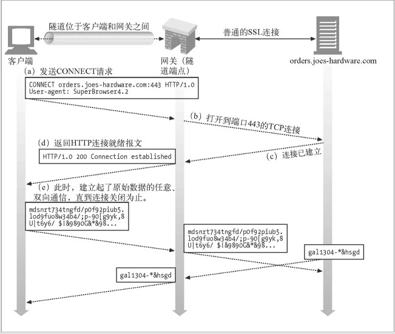

#### ZX-Jump Http/Https代理服务器 用于穿越长城
* 之前想安装个chrome插件,结果蓝灯崩了,而github上许多的翻墙软件也被封了.还有的软件下载界面全是反共的宣言,  
不太信得过.于是去vultr买了服务器,装了shadowsocks,但用起来不顺手,就想着自己写一个代理服务器.

#### 注意点
* ctx.writeAndFlush() 和 ctx.channel().writeAndFlush()的区别,前者会直接从当前handler发送消息,后者还会经过后续的handler.
* netty的每次创建出一个连接channel的时候都会调用在之前定义的通道初始化器初始化该channel.

#### Bug
* 放在服务器上后,稍微访问几个网页,就全部报 : java.io.IOException: Connection reset by peer

#### 思路
* 简单说下浏览器的处理流程
    >
        假设我们访问http://www.baidu.com,浏览器会自动帮我们创建出一个http请求报文,大致如下
        GET /  HTTP/1.1     # 请求行: 请求方法 请求路径 请求协议版本,  下一行开始是请求头
        Host: www.baidu.com
        User-Agent: Mozilla/5.0 (Windows NT 6.1; WOW64) AppleWebKit/537.36 (KHTML, like Gecko) Chrome/63.0.3239.132 Safari/537.36
        Connection: keep-alive
        content-length: 0
        
        通过请求头的host得知访问的域名是www.baidu.com,通过DNS解析出ip,向该IP的80端口发送这段报文.
        此时,假设该百度ip对应的服务器上部署的是Tomcat容器,那么,Tomcat会自动解析该字符串,将其组装为HttpServletRequest.然后响应Response
        浏览器收到响应后,解析响应内容,然后进行后续操作(将html解析为页面,继续请求其中的css/js等,然后运行js等操作)
    >   
* 代理服务器的简单实现
    >
        1. 代理服务器:创建Socket服务端,监听消息.
        2. 本地配置Internet选项的Http代理,将自己电脑(浏览器)的所有请求转发到代理服务器.
        3. 代理服务器获取到本机发送的请求报文后,转发给目标主机(也就请求行中的主机信息,例如百度)
        4. 目标主机响应信息给代理服务器后,地理服务器将响应发送回自己的电脑(浏览器)即可.
    >
* 如上只适用于普通的Http请求,但如果是Https,大致流程如下(参考:https://zhuanlan.zhihu.com/p/28767664):
    
    1. 浏览器发送Http Connect连接请求
    > CONNECT baidu.com:443 HTTP/1.1
    2. 代理服务器收到请求后,同样解析出 目标主机 和 端口(443),然后与目标主机建立TCP连接,并先响应给浏览器如下报文
    > HTTP/1.1 200 Connection Established
    3. 建立完连接后,浏览器继续发送后续的请求内容,我们需要将其转发给目标主机,然后目标主机也会发送回响应,我们同样将其发送回浏览器.
    4. 如上发送/响应可能会进行多次,并且内容都是经过加密的.
    
* 总结
    >
        对于普通Http请求,我们要做的只是转发请求到目标主机,并且中间可以任意获取/篡改请求或响应内容.
        而对于Https请求,我们需要事先建立和目标主机的连接,然后告诉浏览器连接建立成功,然后让双方任意发送消息.
        如此,也可以得出,Http想比于Https,安全性实在太弱.
    >

#### 大致流程
* 使用SpringBoot搭建.
* 使用Netty作为服务端.然后设置好internet中的代理为127.0.0.1:port(注意,需要禁用其中的自动脚本,因为它的优先级比普通代理高)
* 于是,在读取事件中,获取到浏览器的请求报文,例如:
    * Http
        >
            GET http://csdnimg.cn/public/favicon.ico HTTP/1.1
            Host: csdnimg.cn
            Proxy-Connection: keep-alive
            Pragma: no-cache
            Cache-Control: no-cache
            User-Agent: Mozilla/5.0 (Windows NT 6.1; WOW64) AppleWebKit/537.36 (KHTML, like Gecko) Chrome/63.0.3239.132 Safari/537.36
            Accept: image/webp,image/apng,image/*,*/*;q=0.8
            Referer: http://blog.csdn.net/zuoxiaolong8810/article/details/65441709
            Accept-Encoding: gzip, deflate
            Accept-Language: zh-CN,zh;q=0.9
            content-length: 0
        
            第一行为请求行,包括了http的请求方式,请求的主机和请求的http协议版本.
            后面都是请求头,包括了Cookies等信息(如果有的话).最后的content-length: 0,是因为GET请求没有请求体.
        >
    * Https
        >
            CONNECT webim.tim.qq.com:443 HTTP/1.1
            Host: webim.tim.qq.com:443
            Proxy-Connection: keep-alive
            User-Agent: Mozilla/5.0 (Windows NT 10.0; WOW64) AppleWebKit/537.36 (KHTML, like Gecko) Chrome/62.0.3202.94 Safari/537.36
            
            对于HTTPS来说,第一次的请求都是CONNECT(连接请求).请求头的信息通常也就这么3个主要的.
        >
    * 代理和非代理报文区别
        >
            可以发现,在使用ip代理后,请求报文有如下变化:
                1. 浏览器会自动在请求行上添加要请求的完整路径.(例如, GET /public/favicon.ico HTTP/1.1 变为了 GET http://csdnimg.cn/public/favicon.ico HTTP/1.1)
                    这个设计是因为在早期Http设计中,没有http代理时,目标服务器收到请求后,假设请求行中的uri为/a/b.
                    那么目标服务器可以很清楚的知道它要访问的是自己的/a/b路径.
                    而使用代理后,并不知道 目标服务器的完整地址,所以需要携带目标服务器的完整路径.
                    后来,为了解决虚拟主机的问题,几乎所有的浏览器都会在请求头中携带host属性,也就解决了这个问题.
                2. 请求头中的Connection属性变为Proxy-Connection
                    (Http1.1中,默认keep-alive,除非显式指定Connection: close)
                    因为老旧代理(Http1.0)不认识Connection属性,会将其作为无关属性直接转发给目标服务器.
                    但目标服务器会根据其要求(Connection: keep-alive),保持长连接,而代理则不会保持这个连接.
                    客户端收到代理转发回去的响应后(浏览器也会根据其要求),保持长连接,但此时代理已经关闭了这个连接.
                    为了解决这个问题,就出现了Proxy-Connection,
                        如果代理是Http1.1,那么,可将其自动重写为Connection.再发送给目标服务器.
                        如果代理是1.0,那么,服务器会收到Proxy-Connection,就发现它是代理,因为它没有自动将其转为Connection.就会在响应中添加Connection:close即可.
        >
        
* 测试:接收请求后,不将其转发给目标主机,直接返回自定义的响应报文
    * 伪代码(Http规定头信息必须有\r\n\r\n,一旦读取到\r\n\r\n,就会将往后的部分识别为请求主体,例如下面的html和响应头空了一行,也就是\r\n\r\n) 
    >
        //拼接出自定义响应报文
        StringBuilder sb = new StringBuilder();
        sb.append("HTTP/1.1 200 OK\r\n")
                .append("Content-Type: text/html; charset=UTF-8\r\n\r\n")
                .append("<html>" +
                        "<head></head>" +
                        "<body>" +
                        "<h1>测试响应</h1>" +
                        "</body>" +
                        "</html>");
        //将自定义响应报文发送回浏览器                
        sendResponse(sb.toString().getBytes("UTF-8"));
    >
    * 响应报文
    >
        HTTP/1.1 200 OK
        Content-Type: text/html; charset=UTF-8
        
        <html><head></head><body><h1>测试响应</h1></body></html>
        
        
        第一行为响应行,然后是响应头,然后是响应主体
    >
    * 此时,浏览器访问Http网页时,将会在页面上显示 测试响应

#### 开始编码
* Netty服务端启动类,启动Socket监听对应端口
>
    /**
     * author:ZhengXing
     * datetime:2018-01-21 13:56
     * 代理服务器
     */
    @Component
    @Slf4j
    public class ProxyServer {
        //静态参数-netty处理器的名字,用于在https请求时,剔除channel中绑定的编解码相关处理类,因为https请求无法解析其加密的数据
        public static final String NAME_HTTP_CODE_HANDLER = "httpCode";
        public static final String NAME_HTTP_AGGREGATOR_HANDLER = "httpAggregator";
        public static final String NAME_PROXY_SERVER_HANDLER = "proxyServerHandler";
    
        /**
         * 代理服务器处理类  主要逻辑都在这个类
         * 继承 {@link io.netty.channel.ChannelInboundHandlerAdapter}
         * 处理输入事件,例如 收到消息/通道激活/通道绑定等
         */
        private final ProxyServerHandler proxyServerHandler;
        /**
         * 继承{@link io.netty.channel.ChannelOutboundHandlerAdapter}
         * 处理输出事件,例如写入事件 , 处理该代理服务器向 客户端发送回去的 报文等
         */
        private final ProxyServerOutboundHandler proxyServerOutboundHandler;
        private final ProxyConfig proxyConfig;
        @Autowired
        public ProxyServer(ProxyServerHandler proxyServerHandler, ProxyServerOutboundHandler proxyServerOutboundHandler, ProxyConfig proxyConfig) {
            this.proxyServerHandler = proxyServerHandler;
            this.proxyServerOutboundHandler = proxyServerOutboundHandler;
            this.proxyConfig = proxyConfig;
        }
    
        /**
         * 启动Netty server,监听指定端口的TCP连接.
         * 此处监听客户端向我们发送的http报文
         */
        @SneakyThrows
        public void start() {
    
            //1 用于接收Client的连接 的线程组
            EventLoopGroup bossGroup = new NioEventLoopGroup(8);
            //2 用于实际业务操作的线程组
            EventLoopGroup workerGroup = new NioEventLoopGroup(40);
            //3 创建一个辅助类Bootstrap（引导程序）,对server进行配置
            ServerBootstrap serverBootStrap = new ServerBootstrap();
            //4 将两个线程组加入 bootstrap
            serverBootStrap.group(bossGroup, workerGroup)
                    //指定使用这种类型的通道
                    .channel(NioServerSocketChannel.class)
                    //使用 childHandler 绑定具体的事件处理器
                    .childHandler(new ChannelInitializer<SocketChannel>() {
                        @Override
                        protected void initChannel(SocketChannel socketChannel) throws Exception {
                            //设置字符串形式的解码  这样serverHandler中获取到的msg可以直接(String)msg转为string
                            socketChannel.pipeline()
                                    //心跳检测：超过xs未触发触发读取事件，则触发userEventTriggered()事件
    //                                .addLast("idleState handler",new IdleStateHandler(0,0,2, TimeUnit.SECONDS))
    
                                    //组合了http请求解码器和http响应编码器的一个类,可自定义各种最大长度
                                    .addLast(NAME_HTTP_CODE_HANDLER, new HttpServerCodec())
                                    //消息聚合器,注意,需要添加在http编解码器(HttpServerCodec)之后
                                    .addLast(NAME_HTTP_AGGREGATOR_HANDLER, new HttpObjectAggregator(65536))
                                    //自定义 输入事件 处理器
                                    .addLast(proxyServerOutboundHandler)
                                    //自定义 客户端输入事件 处理器
                                    .addLast(NAME_PROXY_SERVER_HANDLER, proxyServerHandler);
                        }
                    })
                    /**
                     * TCP连接的 参数
                     * tcp三次握手：
                     *  客户端发送有SYN标志的包（第一次）
                     *  服务器收到后，向客户端发送SYN ACK（第二次）
                     *  此时，TCP内核模块把客户端连接放入A队列，
                     *  然后服务器收到客户端再次发来的ACK时（第三次）
                     *  TCP内核把客户端连接放入B队列，连接完成,完成accept()方法
                     *  此时，TCP内核会被客户端连接从队列B中取出。完成。
                     *
                     *  A队列和B队列长度之和就是backlog，如果大于backlog，新连接会被拒绝
                     *  注意，backlog对程序支持的连接数并无影响，backlog只影响还未完成accept()方法的连接。
                     */
                    //服务端接受连接的队列长度
                    .option(ChannelOption.SO_BACKLOG, 2048)
                    //保持连接,类似心跳检测,超过2小时空闲才激活
    //                .childOption(ChannelOption.SO_KEEPALIVE, true)
                    //接收缓冲区大小
                    .option(ChannelOption.SO_RCVBUF, 128 * 1024);
            log.info("代理服务器启动,在{}端口",proxyConfig.getSocket().getProxyPort());
            //5 绑定端口,进行监听 异步的  可以开启多个端口监听
            ChannelFuture future = serverBootStrap.bind(proxyConfig.getSocket().getProxyPort()).sync();
            //6 关闭前阻塞
            future.channel().closeFuture().sync();
            //7 关闭线程组
            bossGroup.shutdownGracefully().sync();
            workerGroup.shutdownGracefully().sync();
        }
    }
>

* Netty Socket Server 输入事件处理类
    * 主要功能如下:
        1. 接收客户端报文
        2. 当报文为Http协议时,另起一个连接,连接到目标服务器,并给这个与目标服务器的连接设置监听器/处理器  
            >
                连接成功后,在该监听器中自动发送客户端发送的报文 给 目标服务器,目标服务器响应后,
                处理器读取事件被触发, 读取该响应,发送回客户端即可.
            >
        3. 当报文为Https协议时,先直接返回客户端200响应,表示已经与目标服务器建立了连接,然后另起一个连接,连接到目标服务器,并给这个与目标服务器的连接设置监听器/处理器
            >
                此时,客户端会继续发送后续的加密信息,我们直接将其转发给目标服务器,然后将目标服务器的响应直接转发回客户端即可.
                这些后续操作,在channelRead()方法中,需要判断收到的消息是不是FullHttpRequest的子类,也就是不是符合http报文格式,
                如果不符合,即表示其为https请求的后续操作.
            >
        4. 因为考虑将该类设置为可供所有channel使用,所以,使用缓存,以便在https协议后续请求到来时,还能获取到之前的
